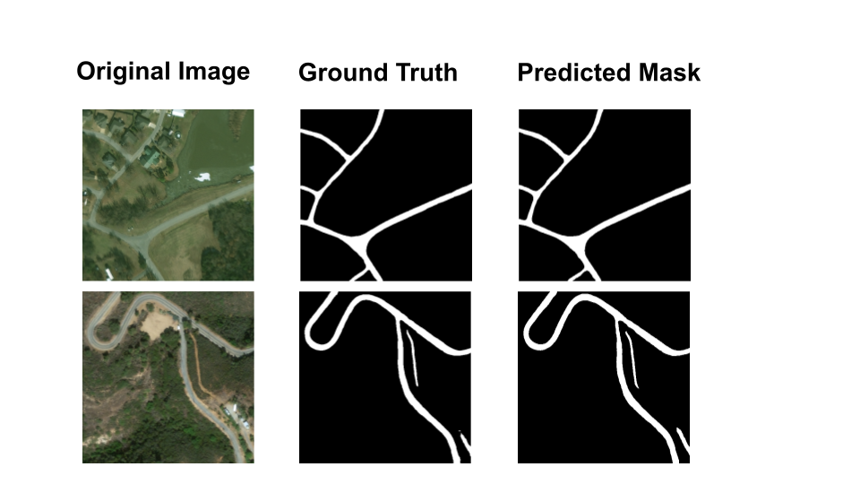
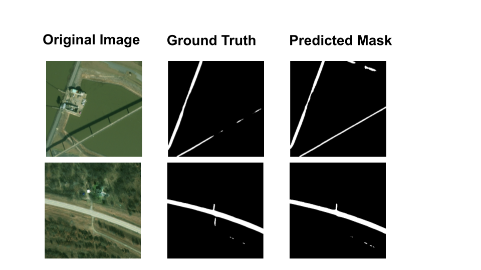

# xBD Road Semantic Segmentation

This repository contains the deep learning model implementation code for performing **semantic segmentation** of roads using **xBD** data. This project provides a complete pipeline from data preprocessing to model training, evaluation, and inference.

-----

## Table of Contents

  - [xBD Road Semantic Segmentation](#xbd-road-semantic-segmentation)
      - [Table of Contents](#table-of-contents)
      - [Project Overview](#project-overview)
      - [Features](#features)
      - [Requirements](#requirements)
      - [Installation Guide](#installation-guide)
      - [Dataset](#dataset)
      - [Usage](#usage)
      - [Results](#results)
      - [How to Contribute](#how-to-contribute)
      - [License](#license)
      - [References](#license)

-----

## Project Overview

This project implements a semantic segmentation model designed to accurately delineate road areas using the xBD dataset. The model leverages a deep learning-based network and incorporates various preprocessing and data augmentation techniques to enhance training performance.

-----

## Features

  - **End-to-End Pipeline:** Provides a complete workflow from data preprocessing to model training, evaluation, and inference.
  - **Modular Design:** Each component (data loader, model, training script, etc.) is independently structured for easy extension and maintenance.
  - **GPU Support:** Utilizes CUDA for a fast training environment.

-----

## Requirements

  - Python 3.8 or higher
  - PyTorch (or your deep learning framework of choice)
  - CUDA (for GPU acceleration)
  - Other Python libraries: `numpy`, `opencv-python`, `albumentations`, `matplotlib`, etc.
    *(Refer to `requirements.txt` for a complete list)*

-----

## Installation Guide

1.  **Clone the repository:**

    ```bash
    git clone https://github.com/seunghyeokleeme/xBD_road_segmentation.git
    cd xBD_road_segmentation
    ```

2.  **Create and activate a virtual environment (optional but recommended):**

    ```bash
    python3 -m venv venv
    source venv/bin/activate  # On Linux/macOS
    venv\Scripts\activate     # On Windows
    ```

3.  **Install dependencies:**

    ```bash
    pip install -r requirements.txt
    ```

-----

## Dataset

This project uses the xBD dataset. The dataset should be organized as follows:

**Note: This project focuses on road segmentation, not building segmentation, so manual road labeling of the xBD dataset is required.**

```
datasets/
├── train/
│   ├── images/
│   └── targets/
├── hold/
│   ├── images/
│   └── targets/
└── test/
    └── images/
    └── targets/
```

  - **Download:**

    1.  You can download the original 1024x1024 xBD dataset from the [official xBD page](https://xview2.org) and then manually perform road labeling.
    2.  **Recommended:** Download pre-labeled road data (already cropped to 512x512 with 4 crops) from this [Google Drive link](https://www.google.com/search?q=https://drive.google.com/drive/folders/1Kd329puBn5_Nc_3Lg5READct4Whd7erR).

    If you're curious about the manual labeling process, please refer to my other project: [xBD Road Damage Assessment](https://github.com/seunghyeokleeme/xBD_road_damage_assessment).

-----

## Usage

1.  **Extract the datasets archive:**

    ```bash
    python3 ./data_read.py
    ```

2.  **(Optional) Crop 1024x1024 images into 4x 512x512 crops:**
    This step is not necessary if you downloaded the pre-cropped data from the Google Drive link.

    ```bash
    python3 ./crop.py --datasets_dir="./datasets" \
    --save_dir="./datasets_512"
    ```

3.  **Start TensorBoard:**

    ```bash
    tensorboard --logdir='./log'
    ```

4.  **Train the model:**

    ```bash
    python3 ./train.py \
      --lr 1e-3 \
      --batch_size 12 --num_epoch 50 --seed 0 \
      --data_dir "./datasets_512" \
      --ckpt_dir "./checkpoint_v1" \
      --log_dir "./log/exp1" \
      --result_dir "./results_v1" \
      --mode "train" \
      --train_continue "on"
    ```

5.  **Test the model:**

    ```bash
    python3 ./train.py \
      --lr 1e-3 \
      --batch_size 12 --num_epoch 50 --seed 0 \
      --data_dir "./datasets_512" \
      --ckpt_dir "./checkpoint_v1" \
      --log_dir "./log/exp1" \
      --result_dir "./results_v1" \
      --mode "test" \
      --train_continue "off"
    ```

6.  **Evaluate performance:**

    ```bash
    python3 ./eval.py \
    --result_dir "./results_v1" \
    --out_fp "./localization_metrics.json"
    ```

7.  **Run inference:**

    ```bash
    python3 ./inference.py \
    --lr 1e-3 --batch_size 4 \
    --data_dir "./inference_datasets" \
    --ckpt_dir "./checkpoint_v1" \
    --result_dir "./inference_v1"
    ```

-----

## Results

The average F1-score is $0.870 \pm 0.004$.

The model is trained for 100 epochs per run. For performance testing, the model checkpoint with the lowest validation loss is used.

| Parameter         | Experiment 1        | Experiment 2        | Experiment 3        | Experiment 4        |
|:------------------|:--------------------|:--------------------|:--------------------|:--------------------|
| Image Size        | 512 x 512 (4 crops) | 512 x 512 (4 crops) | 512 x 512 (4 crops) | 512 x 512 (4 crops) |
| Learning Rate     | 1.0000e-03          | 1.0000e-03          | 1.0000e-03          | 1.0000e-03          |
| Batch Size        | 12                  | 12                  | 12                  | 12                  |
| Seed              | 0                   | 1                   | 2                   | 3                   |
| Model             | U-Net               | U-Net               | U-Net               | U-Net               |
| Precision         | 0.8807              | 0.8952              | 0.8796              | 0.8485              |
| Recall            | 0.8553              | 0.8387              | 0.8682              | 0.8930              |
| F1 Score          | 0.8678              | 0.8660              | 0.8739              | 0.8702              |
| Accuracy          | 0.9940              | 0.9940              | 0.9942              | 0.9938              |
| IoU               | 0.7665              | 0.7637              | 0.7760              | 0.7702              |

-----

# Result Visualization




-----

## How to Contribute

We welcome contributions to this project\! Here's how you can help:

1.  Fork the repository.
2.  Create a new branch (`git checkout -b feature/YourFeature`).
3.  Make your code changes and improvements.
4.  Commit your changes (`git commit -m 'Add some feature'`).
5.  Push to your remote repository (`git push origin feature/YourFeature`).
6.  Open a Pull Request.

-----

## License

This project is distributed under the [MIT License](LICENSE).

-----

## References

  - [xBD Official Page](https://xview2.org)
  - [PyTorch Documentation](https://pytorch.org/docs/)
  - [U-net: Convolutional Networks for Biomedical Image Segmentation](https://arxiv.org/abs/1505.04597)